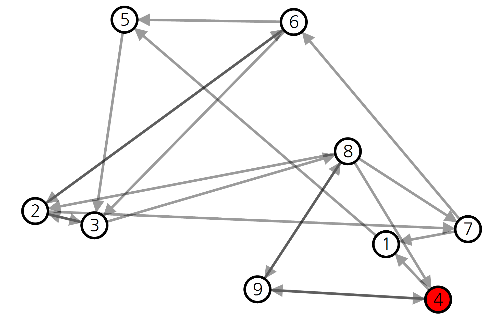
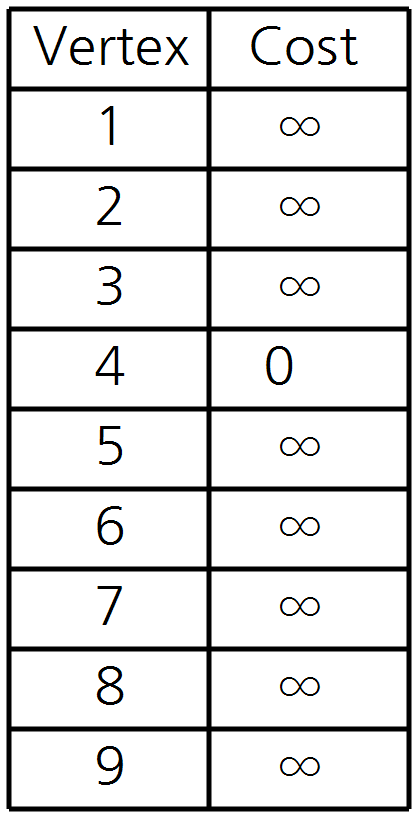
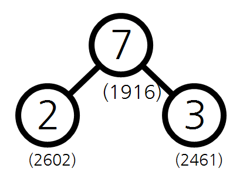

# Dijkstra_algorithm_visualization
최소 힙(min-heap)구조를 이용하는 다익스트라 알고리즘(Dijkstra's algorithm) 시각화


**구현 영상**

[](http://www.youtube.com/watch?v=FXUY8qikri8)


## 0. 그대로 실행 시 주의사항
그대로 실행 시, 하위 디렉토리 ```\datas``` 에 시각화 내용에 대해 모두 저장하도록 되어 있습니다.
수많은 파일을 생성하고 싶지 않다면, ```Dijkstra.cs``` 에서 ```Dijkstra```클래스의 ```visualize()``` 함수를 수정하세요.

## 1. 다익스트라 알고리즘과 최소 힙
**다익스트라 알고리즘**

 정점(Vertex)과 간선(Edge) 그리고 간선의 가중치가 부여된 그래프에서 모든 정점에 대해 한 출발 정점으로 부터의 최소 비용(경로)을 구하는 알고리즘

**최소 힙**

 완전 이진트리(complete binary tree)에서 부모 노드가 자식 노드보다 항상 작은 자료구조로, 루트 노드에 항상 최솟값이 위치하게 된다. 데이터가 변하는 상황에서 빠르게 최솟값을 찾을 수 있기 때문에 다익스트라 알고리즘에 사용하면 시간 복잡도를 줄일 수 있다.
 
## 2. 시각화 방법
## 2.1. 그래프 시각화

**그래프 형태 출력(간선의 가중치는 정점 사이 픽셀 거리)**




**각 정점까지 최소비용 출력**



## 2.2. 힙 구조 시각화

**힙에 삽입된 정점 변수 표현**


**힙 구조 트리 형태 출력**


